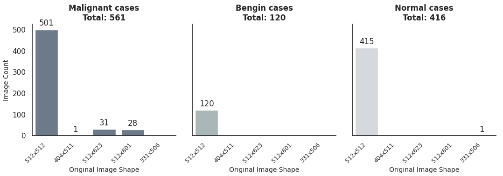
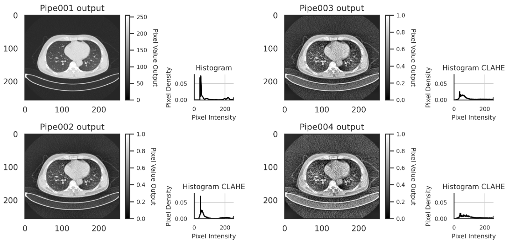
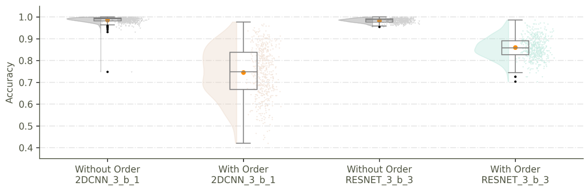

<a name="top"></a>
# Lung Cancer Detection with Deep Learning [🔝](#top)

This repository accompanies the paper:
**"AI Medical Diagnosis in Lung Cancer: Issues of Bias and Fairness"**,

We provide a reproducible Deep Learning (DL) experimental pipelines for lung cancer detection using DL architectures. This includes custom data preprocessing strategies, data split considerations, multiple architecture designs, and rigorous model evaluation setups.

---

## 📚 Table of Contents
- [📦 Project Setup](#-project-setup)
- [📂 Project Folder Structure & Naming Convention](#-project-folder-structure--naming-convention)
- [🗃️ Expected Raw Data Structure](#️-expected-raw-data-structure)
- [📈 Initial Data Exploration](#-initial-data-exploration)
- [🔁 Deep Learning Pipeline Overview](#-deep-learning-pipeline-overview)
  - [🔧 Raw Data Preprocessing Pipelines](#-raw-data-preprocessing-ipelines)
  - [🏗️ Architecture, Splitting & Training](#️-architecture-splitting--training)
  - [📂 Results Storage Format](#-results-storage-format)
  - [📓 Training Notebooks](#-training-notebooks)
- [📊 Post-Performance Analysis](#-post-performance-analysis)
- [🧱 Docker & Environment](#-docker--environment)
- [📌 Notes on PyTorch + CUDA Compatibility](#-notes-on-pytorch--cuda-compatibility)

---
## 📦 Project Setup

1. Install and launch [Docker Desktop](https://www.docker.com/products/docker-desktop/).
2. Clone this repository:
   ```bash
   git clone https://github.com/your_username/lungcancer_.git
   cd lungcancer_
   ```
3. Start JupyterLab via Docker Compose:
   ```bash
   docker compose --compatibility up
   ```
4. Open your browser and go to: [http://localhost:8000/lab](http://localhost:8000/lab)
   - JupyterLab password: `password`

> **Build Time**: The Docker image takes ~813 seconds to build (with 60 Mbps bandwidth).


[🔝](#top)
---

## 📂 Project Folder Structure & Naming Convention

The repository follows a modular folder structure:
```
.
├── data/                # Contains original and preprocessed datasets
│   └── 01_original/     # Original dataset (see Expected Raw Data Structure)
│   └── {pipe_id}/       # Output from preprocessing notebooks
├── notebooks/           # Main experimentation area
│   └── {task ID}/       # Task-focused goal
│       └── {exp ID}/    # Experiment-specific steps to reach task goal (.ipynb or .py)
│           └── (Optional: quick viz, other)
├── results/             # Stores all experiment tracking outputs
├── env files            # Dockerfile, docker-compose.yml, requirements.txt
├── README.md            # Project documentation
```

This organization allows independent prototyping under each task/experiment scope, enabling iterative and reproducible development.

- Task ID: `tsk01` — Focused on image-level detection of lung cancer labels using the IQ-OTH/NCCD dataset.
- Experiment ID: `exp01` — Compares the performance of data split strategies: with vs. without consideration of CT scan order during train-test splitting. This experiment also explores performance improvements across Vanilla 2DCNN, ResNet, and AlexNet architectures.


All notebooks follow the naming structure:
```
{AI DeveloperInitial}_{TaskID}_{ExperimentID}_{NotebookID}_{ShortDesc}_{VariationsID}.ipynb
```
- Each notebook output will use the naming convention as id to track back the source code, e.g.:
  - `{AI DeveloperInitial}_{TaskID}{ExperimentID}{NotebookID}{VariationsID}_Boxplot_name.png`.

[🔝](#top)
---
## 🗃️ Expected Raw Data Structure 

Download the dataset from Mendeley Data:
**[IQ-OTH/NCCD Lung Cancer Dataset](https://data.mendeley.com/datasets/bhmdr45bh2/1)**

Place the raw dataset in the following path:
```
data/01_original/IQ_OTHNCCD_LungCancer/IQ_OTHNCCD/
  ├── Bengin cases/
  ├── Malignant cases/
  └── Normal cases/
```




CT scan counts per class and image size


[🔝](#top)
---
## 📈 Initial Data Exploration

- `FR_t01e01nb01_initial_tasteExploration_of_raw_data_v1.ipynb`

[🔝](#top)
---
## 🔁 Deep Learning Pipeline Overview

All steps are implemented in modular Jupyter Notebooks. The project uses a pragmatic structure for AI researchers and practitioners.

### 🔧 Raw Data Preprocessing Pipelines

Each preprocessing pipeline loads raw data, transforms it, and saves the output as `.npy` files. Additionally, each pipeline generates a metadata file containing details about the processed .npy files for later use.

The following notebooks represent distinct preprocessing steps:
- `FR_t01e01nb02_pre-processing_pipeline_v1_pipe001_.ipynb`
- `FR_t01e01nb02_pre-processing_pipeline_v2_pipe002.ipynb`
- `FR_t01e01nb02_pre-processing_pipeline_v3_pipe003.ipynb`
- `FR_t01e01nb02_pre-processing_pipeline_v4_pipe004.ipynb`



Example of CT scan image after being loaded and transformed by each preprocessing pipeline

> 🔍 Output images from each preprocessing strategy are illustrated within the notebooks.

[🔝](#top)

### 🏗️ Architecture, Splitting & Training

Each notebook follows this inner sections structure:
- **Import Libraries**
- **Config**: Controls experiment ID, data paths.
- **Utility Functions**: Includes the `train()` function which track DL experiments results.
- **Arch| Designs**: Defines model (2DCNN, ResNet, AlexNet).
- **Training Steps**: Includes subsection `Training configuration` with whole DL pipeline hyperparameter tuning.

### 📂 Results Storage Format

After training, all outputs are saved to:
```
results/exp_track/TrainTrack_{id}/
  ├── ML_pipe_params/             # DL pipeline hyperparameters
  ├── models/                     # (Optional) Trained weights
  ├── performance_across_epochs/  # Metric logs for each epoch
  └── predictions/                # Final predictions for test/train sets
```

### 📓 Training Notebooks

#### First Group — Single Stratified 5KfoldCV:
- `FR_t01e01nb03_Training_v1_vanillaCNN.ipynb`
- `FR_t01e01nb03_Training_v2_ResNet.ipynb`
- `FR_t01e01nb03_Training_v3_AlexNet.ipynb`
  - Training hyperparameter to control conditions "Without and With Order" consideration of CT scans: `pipe_params['split_strategy']['shuffle_instances']`

#### Second Group — Repeated Stratified 5KfoldCV:
- `FR_t01e01nb04_Training_RepeatKFoldCV_v1_vanillaCNN.ipynb`
- `FR_t01e01nb04_Training_RepeatKFoldCV_v2_ResNet.ipynb`
  - Extends `custom_StratifiedKFold()` and Training Step to handle multiple repetitions of 5KfolCV

[🔝](#top)
---
## 📊 Post-Performance Analysis

This flexible section supports identifying directions for improving:
- Data preprocessing: CT scan image transformations, feature engeniering, feature selection, etc.
- Training Strategy: Modifying/Controling the way that the DL Architecture learn patterns.
- DL architecture: Modifying/Adding/Connecting layers, DL structures, etc to better fit the input data patterns.

All Post-Performance analisis can be found here: 
- `FR_t01e01nb100_VIZ_Kfold_results_analysis_v1.ipynb`



Based on the previous image results:
- Condition "Without Order": Ignoring CT scan order during data splitting appears to inflate performance metrics.
- Condition "With Order": When CT scan order is considered, the RESNET pipeline shows improved performance, achieving a mean Accuracy of 86%, with a 95% confidence interval ranging from 77% to 95% for unseen CT scan images that are similar to the lung cancer cases represented in the IQ-OTH/NCCD dataset.


[🔝](#top)
---
## 🧱 Docker & Environment

### Add Python Libraries (inside the container)
Open terminal in jupyter lab
```bash
pip install "your_library"
pwd  # ensure you are in /workspace
pip freeze | grep -v "feedstock_root" > requirements.txt
```

### Base Image
Current: `nvidia/cuda:12.2.2-runtime-ubuntu22.04`

[🔝](#top)
---
## 📌 Notes on PyTorch + CUDA Compatibility
If you change the CUDA version, ensure PyTorch matches it. Example installation for CUDA 11.8:
```bash
pip3 install torch torchvision torchaudio --index-url https://download.pytorch.org/whl/cu118
```
- `torch==2.7.0+cu118`
- `torchvision==0.22.0+cu118`
- `torchaudio==2.7.0+cu118`


[🔝](#top)
---

For any questions or issues, feel free to open an issue or contact the first author.

